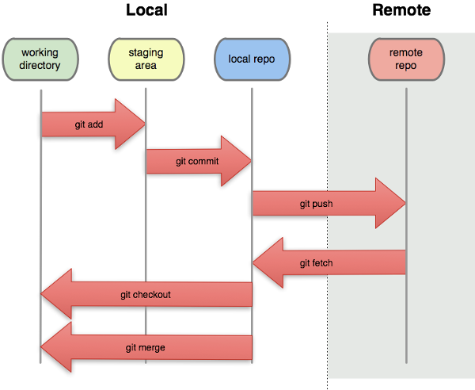

# Discuss

What is your current version control system?

1. How do you manage different file versions?
2. How do you work with collaborators on the same files?
3. How much would your science/teaching/life suffer if your workstation exploded right now? (scale from 1-10)


# What is git

Version control system (VCS)

- manage different versions of files
- collaborate with yourself
- collaborate with other people
- in principle a commandline tool, but can use convenient graphical interfaces
  and websites (GitHub/GitLab/BitBucket)
- many modern editors support it directly without the need of external software

# Why use git

"Always remember your first collaborator is your future self, and your past self doesn't answer emails" 

- Christie Bahlai


# What is git good for?

- backup
- reproducibility
- collaboration
- organization
- transparency


# Installation on Windows & Mac

1. - **On Mac OS**, git and ssh should already be available on the
commandline. If not, install with [Homebrew](https://brew.sh/), using
     ```
	 brew install git
	 ```
	- **On Windows:** [Git Bash & GUI](https://git-scm.com/downloads):
	    - includes Git Bash, a command-line terminal which simulates that of a Unix machine
		  and includes the git commandline client & a SSH client
2. [GitHub Desktop](http://windows.github.com): a simple & very convenient GUI

    Optionally, create yourself an account on GitHub and log in on
GitHub Desktop. (We will actually use GitLab for most things, but having
access to GitHub directly is nice as well.)

---

# Installation on Linux

- usually nothing to do!
- if necessary,  `apt-get install git`
- use your favourite editor (e.g. Emacs)
- use git on the commandline
- GUI alternatives:
  - if you use Emacs, install `magit` package.


# Initial Git & SSH configuration

- Set your name and email in Git:
   - in GitHub Desktop: Options -> Git
   - or, on the commandline:
     ```
     git config --global user.name "Vlad Dracula"
     git config --global user.email "vlad@tran.sylvan.ia"
	 git config --list
     ```

- Create yourself an SSH key pair:
    - On the commandline (Git Bash on Windows), do:
      ```
	  ssh-keygen -t ed25519
	  ```
- Upload your public SSH key to GitLab (and/or GitHub):
    - After logging on the website, click on your profile image, User Settings, SSH Keys
	- Copy & Paste your **public** key, usually found in `~/.ssh/id_ed25519.pub` (or
      maybe `id_rsa.pub` if you already had an older key)
	- in Git Bash, you can use the command
	  ```
	  cat ~/.ssh/id_ed25519.pub | clip
	  ```
      to easily copy the relevant text.


# Command line git

It's best to play around with git on the commandline at first, to better
understand what it does. (Then it's ok to switch to a GUI.)


Somewhere on your computer, create a new directory with a (text) file, e.g.
`test.tex` or `test.txt`, and fill it with some example content (at least a
few lines). (You could also just copy an already existing document.)

You can do this with your usual methods, or on the commandline, for example with:
```
	mkdir my-first-git-repo
	cd my-first-git-repo
	echo "This is a fancy test!" > test.txt
```

You can also create other files, of whatever type you want (LaTeX, Markdown, HTML, Python
scripts, ...) - binary files are ok as well!


# Tell git to keep track of your files

## Initializing a repository

On the commandline (Git Bash on Windows), make sure that you are inside the
directory you created, then execute:
```
	git init
```

\smallskip
If you call `ls -a`, you should now notice that a hidden `.git/` directory was
created. This is where git does its magic, and you should therefore never
touch this directory or its contents!


## Checking repository status

``` 
	git status
```

You should notice that there are "untracked" files. Right now, git does not
actually do anything with your files yet, we first have to tell it to "track" them.


# Adding your file to be tracked by git

To tell git that you want changes to the file `test.txt` to be "tracked", execute:

```
	git add test.txt
```


\smallskip
	or, to add all changed/new files (careful, this might add undesired
	temporary files):
\smallskip

```
	git add --all
```

**For future reference:** If you want to avoid addingf temporary files (like LaTeX
auxiliary files etc.), you can add a file `.gitignore` which tells git to
_never_ even propose to track these files.  You can download an appropriate
`.gitignore` file for whatever type of document you're working on at <https://www.gitignore.io/>


# Your changes are now "staged"



(Image from Software Carpentry)


# Committing

## Changes aren't final until they're committed

```
git status
```


## Committing

Once you're sure that your changes are worth saving

(THIS WILL GO ON YOUR PERMANENT RECORD)

```
	git commit -m 'changed x, y, and z'
```


If you just use `git commit`, git will open an editor to ask you for a commit
message. You can set the default editor by one of the following commands:

```
	git config --global core.editor "atom --wait"
	git config --global core.editor "emacs -nw"
	git config --global core.editor "zile"
```

# Commit messages

- Describe why and the what "in a nutshell"
- Note to your future self (and to anyone else who you're collaborating with)


# Now make more changes and repeat!


1. Change/add files (using whatever editor you prefer) - for your first test,
   change at least 2 different lines.
2. See a quick overview of what changed, using one or all of the following:

    ```
	   git status
	   git diff
	   git diff file
	```
3. Add ("stage") changes with \quad `git add file(s)`
4. Commit changes with \quad `git commit -m commit-message`
5. View updated log with \quad `git log`


# Now, do something really stupid

- "Accidentally" introduce some errors to your file (or even delete a file!)

- Whoops!  _If only we had access to a time machine..._

- Hang on, we do!

    ```
    git diff
    git checkout HEAD test.txt
    ```


# What happened?


(Image from Software Carpentry)


# Wait, what does HEAD refer to?


(Image from Software Carpentry)


# Mirroring your repository on the internet

Up until now, everything has happened solely on your computer (and in fact,
only in the directory you worked in). To have a backup and to synchronize
between different computers (and possibly collaborators), you should link your
repository to a "remote repository". There are several popular websites for this:


## GitHub vs. GitLab vs. BitBucket

**Private** repos (only accessible by yourself or others you share it with):

- (only very recently) free on GitHub, but only < 4 collaborators.
- free on BitBucket (w/ < 6 collaborators)
- free on GitLab (**unlimited** collaborators)


\smallskip

- all very similar, but differences include:
    - feature set included in free vs. paid plan
    - open source vs. closed source
    - popularity & user base

- _I personally find GitLab the best free offer at the moment - but you can
  use all three if you want (and you can always switch)!_


# Mirroring your repository on the internet

## Setting up a "remote"

1. Create repository (or "project") on the GitLab/GitHub/BitBucket website
   (for now: no .gitignore, no README, and no license)
2. The website should show you instructions on what to do next, but if you
   already have the files and a git repository on your computer, it is simply:

    ```
       git remote add origin URL
    ```

    \smallskip
    (use the URL shown on the website for your project, best the one using SSH,
    to avoid having to type in passwords all the time.)

3. Verify the path of the remote:

    ```
	    git remote -v
    ```

# Synchronizing with the remote

Once your repository has been linked to a remote, you can:

## Push (or "publish") your changes:

```
	git push -u origin master
```
\smallskip
(after the first time, you can simply use `git push`)

\smallskip
You can then check the remote website to see new changes. (Click on "Repository -> commits".)

## Pulling from the remote

To get the latest changes (made by yourself or possibly collaborators) from
the remote, do:

```
    git pull
```


\smallskip
**Technical detail:** `git fetch` only checks the status of the remote, while
`git pull` actually applies those changes in your working directory.


# Overview


(Image from Software Carpentry)

# Things you can do with a remote repository

## Use the fancy website interface

- examine your code, the commit log, keep track of issues, etc.!
- Interface with other services (e.g. Slack.com) to get notifications on
  commits, discuss changes with team members...
- Collaborate with others!


## Synchronize and continue work on a different computer

- If necessary, start from scratch by cloning your remote repo:

    ```
	    git clone URL
	```
- Update the local repo from the remote with:\quad  ```git pull```
- Important rule to remember: Always `git pull` before starting to edit your local files!


# Clone an already existing repository

Find the URL of a repository you want to work on.

- For example, log into GitLab and go to the main page of our
[CourseOutlines-Math-ChamplainStLambert](https://gitlab.com/champlain-math-dept/CourseOutlines-Math-ChamplainStLambert)
repository.

- Click on "Clone" and select the URL shown under "clone with SSH" (this avoids having to type in passwords all the time).

- Now get the files onto your computer:
    - In GitHub Desktop:  "Clone repository", then enter the URL (if the SSH
      URL does not work, try again with the https URL)
    - or, on the commandline:
      ```
      cd folder-where-you-want-it
      git clone URL
      ```
	  	  
- This automatically connects your new local repo with the remote, so you can
  directly use `git push` and `git pull`.

# Branches

- Any repository has a default "branch" in which all files are stored, usually
called "master".  This branch is usually reserved for the current most
up-to-date, well-working production version (good example to keep in mind: the
live files for a website, e.g. <http://math.mychamplain.ca>)

- But when working on new "features", it's usually not a good idea to
immediately put those into the master branch!

- So, instead, you create a new branch, work in there without danger of
destroying anything for others, and finally ask for the changes to be **merged** into
the master branch:

    


# Working in a branch

## Create a local branch

- Create & checkout a new branch (for now, use your first name as the name for
  the branch):
     ```
	 git checkout -b branchname
	 ```
- Work on the files as before, stage, commit, and push to the remote server.
- Inspect the log to see what happened (`git log`)


## Ask for your changes to be merged into `master`

When you're satisfied with your work (and you pushed to the remote), it's time
to "merge" it into the master branch. Usually, only the maintainer of the
repository is allowed to do that, so you need to **create a "Pull Request"**,
which is done on the website:

\smallskip
**On GitLab:**

- go to "Repository -> Branches", it should list all branches
- click on "merge request" next to your branch
- fill in some details in the form to explain what you did


# General Best Practice Rules of Thumb

- **Commit often, perfect later, publish once!**
- Use meaningful commit messages.
- Do _not_ commit anything that can be regenerated from other things that were
  committed. For example, pdf-files which are created from a LaTeX source,
  binary files which were compiled from a C++ source file, etc.
- Note: The case of pdf-files is arguable - it's sometimes nice to have the latest
  compiled document version archived as well, but it is technically an
  unnecessary waste of harddrive space and causes the repository to grow much
  faster than it usually would. Use your own judgment.
- _Always_ use `git pull` before you start editing. This pulls in any changes
  made by others (or yourself on another computer!) from the remote repository.


# Using a graphical user interface (GUI) to git

Now that you're comfortable with the principles behind git, you are ready to
do everything with a few clicks (instead of typing `git add`, `git commit`,
etc. all the time)!

## On Windows or Mac OS:

Install [Github Desktop](https://desktop.github.com/) (if not done yet), then
  add "an already existing repository" from your computer. It's quite
  self-explicatory!

## On Linux:

- If you use Emacs, I recommend installing the `magit` package 
  (ask me for help configuring it if necessary).
- Otherwise, there are many other GUIs for git available (and which might
  already be installed on your system, e.g. `gitk`). There is also an
  unofficial version of [Github Desktop for
  Linux](https://github.com/shiftkey/desktop) (which I haven't tested myself).


# What else?

## Slack.com

- A website with private "chat rooms" or "channels"
- enables convenient on-topic discussions (avoiding email chains and hard to find information),
- with integration to GitLab/GitHub:
    - show notifications about commits
	- create/inspect issues directly from the chat
\smallskip
- I've created a Slack group ["CCSL Math Dept"](https://ccslmathdept.slack.com) for us, simply let me know if you'd
  like me to (re-)send an invitation. 


# Additional ressources

## References

- [Git it](https://github.com/jlord/git-it-electron/releases): Interactive
  Tutorial to learn some more details about git
- [Pro Git](https://git-scm.com/book/en/): free book by Scott Chacon and Ben
  Straub with everything you might ever want to know about git
- [Git Cheat Sheet](https://github.github.com/training-kit/downloads/github-git-cheat-sheet.pdf)

- [On undoing, fixing, or removing commits in git: A git choose your own adventure](http://sethrobertson.github.io/GitFixUm/fixup.html)

- <https://www.gitignore.io/>: Create appropriate `.gitignore` files for your projects

- [Git Best Practices](https://sethrobertson.github.io/GitBestPractices/)


## Specific for us: Champlain St-Lambert Math Department

- [CCSL GitLab repositories](https://gitlab.com/champlain-math-dept): currently
  for Generic Course Plans and [math.mychamplain.ca](http://math.mychamplain.ca)
- [CCSL Slack Group](https://ccslmathdept.slack.com)
