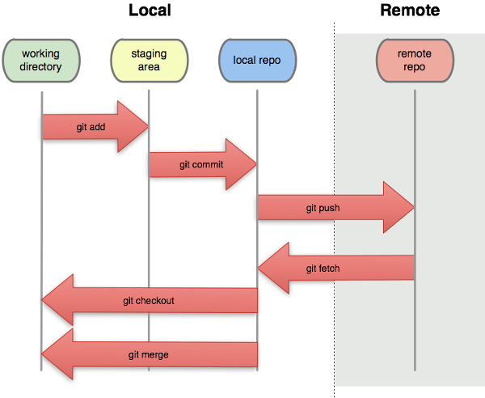

## Discuss

What is your current version control system?

1. How do you manage different file versions?
2. How do you work with collaborators on the same files?
3. How much would your science/teaching/life suffer if your workstation exploded right now? (scale from 1-10)


## What is git

Version control system (VCS)

- manage different versions of files
- collaborate with yourself
- collaborate with other people
- in principle a commandline tool, but can use convenient graphical interfaces
  and websites (GitHub/GitLab/BitBucket)
- many modern editors support it directly without the need of external software

## Why use git

"Always remember your first collaborator is your future self, and your past self doesn't answer emails" 

- Christie Bahlai


## What is git good for?

- backup
- reproducibility
- collaboration
- organization
- transparency


## Installation on Windows & Mac

1. - **On Mac OS**, git and ssh should already be available on the
commandline. If not, install with [Homebrew](https://brew.sh/), using
     ```
	 brew install git
	 ```
	- **On Windows:** [Git Bash & GUI](https://git-scm.com/downloads):
	    - includes Git Bash, a command-line terminal which simulates that of a Unix machine
		  and includes the git commandline client & a SSH client
2. [GitHub Desktop](http://windows.github.com): a simple & very convenient GUI

    \uncover<7>{Optionally, create yourself an account on GitHub and log in on
GitHub Desktop. (We will actually use GitLab for most things, but having
access to GitHub directly is nice as well.)}

---

## Installation on Linux

- usually nothing to do!
- if necessary,  `apt-get install git`
- use your favourite editor (e.g. Emacs)
- use git on the commandline
- GUI alternatives:
  - if you use Emacs, install `magit` package.


## Initial Git & SSH configuration

- Set your name and email in Git:
   - in GitHub Desktop: Options -> Git
   - or, on the commandline:
     ```
     git config --global user.name "Vlad Dracula"
     git config --global user.email "vlad@tran.sylvan.ia"
	 git config --list
     ```

- Create yourself an SSH key pair:
    - On the commandline (Git Bash on Windows), do:
      ```
	  ssh-keygen -t ed25519
	  ```
- Upload your public SSH key to GitLab (and/or GitHub):
    - After logging on the website, click on your profile image, User Settings, SSH Keys
	- Copy & Paste your **public** key, usually found in `~/.ssh/id_ed25519.pub` (or
      maybe `id_rsa.pub` if you already had an older key)
	- in Git Bash, you can use the command
	  ```
	  cat ~/.ssh/id_ed25519.pub | clip
	  ```
      to easily copy the relevant text.


## Command line git

It's best to play around with git on the commandline at first, to better
understand what it does. (Then it's ok to switch to a GUI.)


\pause

Make a directory with a file:

```
mkdir test
cd test
echo "This is a fancy test!" > welcome.txt
```

Create other files, of whatever type you want (LaTeX, Markdown, HTML, Python
scripts, ...) - binary files are ok as well!


## Tell git to keep track of your files

### Initializing a repository

```
git init
```

\smallskip
Notice the `.git/` directory which was created!

\pause
### Checking repository status

``` 
git status
```

\pause
### Adding your file to be tracked by git

```
git add welcome.txt
```

\smallskip
	or, to add all changed/new files (careful, this might add undesired
	temporary files):
\smallskip

```
git add --all
```


## Your changes are now "staged"



(Image from Software Carpentry)


## Committing

### Changes aren't final until they're committed

```
git status
```

\pause
### Committing

Once you're sure that your changes are worth saving

(THIS WILL GO ON YOUR PERMANENT RECORD)

```
git commit -m 'changed x, y, and z'
```


## Commit messages

- Describe why and the what "in a nutshell"
- Note to your future self (and to anyone else who you're collaborating with)

\pause


## What did we do?

### Commands to investigate changes
```
git status
git log
git diff
git diff file
```


## Make another change

1. Change file
2. Add ("stage") changes
3. Commit changes
4. View updated log


## Now, do something really stupid

- "Accidentally" introduce some errors to your file (or even delete a file!)

- Whoops!  _If only we had access to a time machine..._

- Hang on, we do!

    ```
    git diff
    git checkout HEAD welcome.txt
    ```


## What happened?


(Image from Software Carpentry)


## Wait, what does HEAD refer to?


(Image from Software Carpentry)


## Mirroring your repository on the internet

### GitHub vs. GitLab vs. BitBucket

**Private** repos:

- (only very recently) free on GitHub, but only < 4 collaborators.
- free on BitBucket (w/ < 6 collaborators)
- free on GitLab (**unlimited** collaborators)


\bigskip

- all very similar, but differences include:
    - feature set included in free vs. paid plan
    - open source vs. closed source
    - Popularity & user base

\bigskip
\pause
**You can use all three if you want! (But I personally find GitLab the best
free offer at the moment.)**


## Mirroring your repository on the internet

### Setting up a "remote"

1. Create repository on GitHub/GitLab/BitBucket with no .gitignore, no README, and no license

2. Add that as a remote: \quad    `git remote add origin URL`

    (use the URL created for your project on the website, best the one using SSH,
    to avoid having to type in passwords all the time.)

\pause
### How to check:

```
git remote -v
```

\pause
### Once your repository has been linked to remote

Push (or "publish") your changes:

```
git push -u origin master
```
\smallskip
(after the first time, you can simply use `git push`)

\smallskip\pause
Check the remote website to see new changes.


## Overview


(Image from Software Carpentry)

## Things you can do with a remote repository

### Use the fancy website interface

- examine your code, the commit log, keep track of issues, etc.!
- Interface with other services (e.g. Slack.com) to get notifications on
  commits, discuss changes with team members...
- Collaborate with others!

\pause

### Synchronize and continue work on a different computer

- Start from scratch by cloning your remote repo.
- Otherwise, update the local repo by doing:\quad  ```git pull```
- Important rule to remember: Always `git pull` before starting to edit your local files!
\smallskip
- Technical detail: \quad `git fetch` only checks the status of the remote, while
  `git pull` actually moves those changes into your working copy.

## Clone an already existing repository

Find the URL of a repository you want to work on.

- For example, log into GitLab and go to the main page of our
[CourseOutlines-Math-ChamplainStLambert](https://gitlab.com/champlain-math-dept/CourseOutlines-Math-ChamplainStLambert)
repository.

- Click on "Clone" and select the URL shown under "clone with SSH" (this avoids having to type in passwords all the time).

- Now get the files onto your computer:
    - In GitHub Desktop:  "Clone repository", then enter the URL (if the SSH
      URL does not work, try again with the https URL)
    - or, on the commandline:
      ```
      cd folder-where-you-want-it
      git clone URL
      ```
	  	  
- This automatically connects your new local repo with the remote, so you can
  directly use `git push` and `git pull`.

## Branches

- Any repository has a default "branch" in which all files are stored, usually
called "master".  This branch is usually reserved for the current most
up-to-date, well-working production version (good example to keep in mind: the
live files for a website, e.g. <http://math.mychamplain.ca>)

- But when working on new "features", it's usually not a good idea to
immediately put those into the master branch!

- So, instead, you create a new branch, work in there without danger of
destroying anything for others, and finally ask for the changes to be **merged** into
the master branch:

    


## Working in a branch

### Create a local branch

- Create & checkout a new branch (for now, use your first name as the name for
  the branch):
     ```
	 git checkout -b branchname
	 ```
- Work on the files as before, stage, commit, and push to the remote server.
- Inspect the log to see what happened (`git log`)

\pause
### Ask for your changes to be merged into `master`

When you're satisfied with your work (and you pushed to the remote), it's time
to "merge" it into the master branch. Usually, only the maintainer of the
repository is allowed to do that, so you need to **create a "Pull Request"**,
which is done on the website:

\smallskip
**On GitLab:**

- go to "Repository -> Branches", it should list all branches
- click on "merge request" next to your branch
- fill in some details in the form to explain what you did

## What else?

### Slack.com

- A website with private "chat rooms" or "channels"
- enables convenient on-topic discussions (avoiding email chains and hard to find information),
- with integration to GitLab/GitHub:
    - show notifications about commits
	- create/inspect issues directly from the chat
\smallskip
- I've created a Slack group ["CCSL Math Dept"](https://ccslmathdept.slack.com) for us, simply let me know if you'd
  like me to (re-)send an invitation. 


## Additional ressources

### Motivation

- [Ram K. 2013: Git can facilitate greater reproducibility and increased transparency in science.](https://scfbm.biomedcentral.com/articles/10.1186/1751-0473-8-7)

\pause
### References

- [Pro Git](https://git-scm.com/book/en/): free book by Scott Chacon and Ben
  Straub with everything you might ever want to know about git
- [Git Cheat Sheet](https://github.github.com/training-kit/downloads/github-git-cheat-sheet.pdf)

- [On undoing, fixing, or removing commits in git: A git choose your own adventure](http://sethrobertson.github.io/GitFixUm/fixup.html)

\pause
### Champlain St-Lambert Collaboration Ressources

- [CCSL GitLab repositories](https://gitlab.com/champlain-math-dept): currently
  for Generic Course Plans and math.mychamplain.ca
- [CCSL Slack Group](https://ccslmathdept.slack.com)
